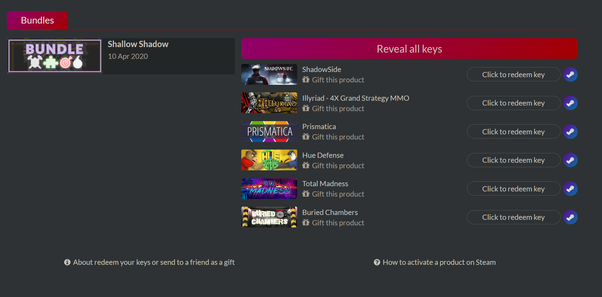
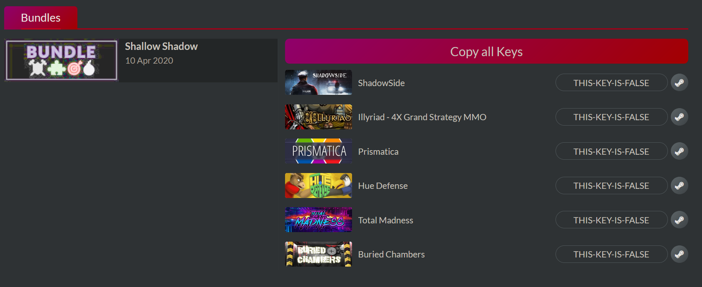
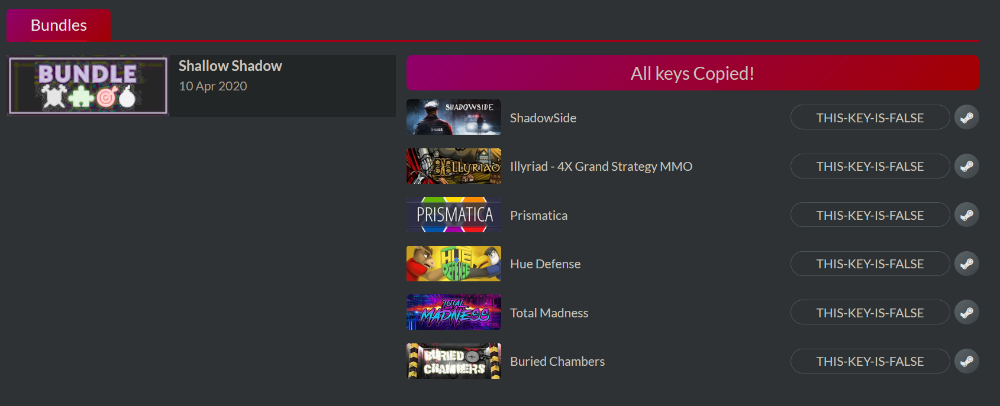

# Indiegala bundle revealer

 Userscript to reveal and copy all game keys with ease

 ## How to install

1. You need to install Tampermonkey in [Firefox](https://addons.mozilla.org/es/firefox/addon/tampermonkey/) or [Chrome](https://chrome.google.com/webstore/detail/tampermonkey/dhdgffkkebhmkfjojejmpbldmpobfkfo)
2. Go to the [raw version of the script](https://raw.githubusercontent.com/MrMarble/Indiegala-bundle-reveal-keys/master/indiegala.user.js) and it should prompt the installation window directly.

## Usage

The script is only executed in the gifted bundle section of indiegala: https://www.indiegala.com/gift-bundle/[bundle-id]

When the script is executed, a button will appear at the top of the game list:

Once you click on it, it will reveal all the keys, when its done it looks like this:

If you click it again, it will copy all the keys separated by space like `KEY1 KEY2 KEY3` and the button text will change again
